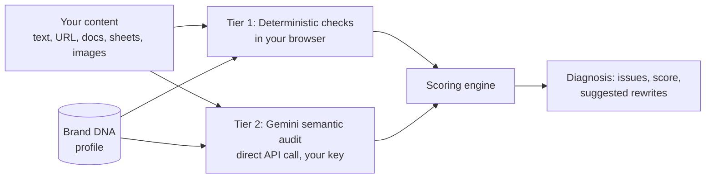

<!--
  README for LoomFrog.
  Checked against: package.json, vite.config.ts, .env.example, the live site,
  and a code audit (file paths and quoted lines) produced inside Google AI Studio.
  Lines marked  <!-- VERIFY: ... -->  are still unconfirmed. Fix them, then delete the comment.
-->

<div align="center">

# 🐸 LoomFrog

### Zero-Server Brand DNA & Tone Consistency Platform

**Audit your writing and visual assets against your own Brand DNA. Instant rule-based checks plus Gemini AI judgment, with no LoomFrog backend.**

[](https://kaimir-auth.github.io/LoomFrog/)


[](./LICENSE)
[](https://github.com/kaimir-auth/LoomFrog/commits/main)

[**Try it now**](https://kaimir-auth.github.io/LoomFrog/) · [How it works](#-how-it-works) · [Privacy](#-privacy-and-your-data) · [Run locally](#-run-it-locally) · [Roadmap](#-roadmap)

<!-- TODO: add a screenshot or 10-second GIF here, e.g.    -->

</div>

---

## 📑 Table of Contents

- [What is LoomFrog?](#-what-is-loomfrog)
- [Why it exists](#-why-it-exists)
- [Features](#-features)
- [How it works](#-how-it-works)
- [Privacy and your data](#-privacy-and-your-data)
- [Quick start (just use it)](#-quick-start-just-use-it)
- [Run it locally (developers)](#-run-it-locally)
- [Available scripts](#-available-scripts)
- [Project structure](#-project-structure)
- [Tech stack](#-tech-stack)
- [Hosting and deployment](#-hosting-and-deployment)
- [Roadmap](#-roadmap)
- [Troubleshooting](#-troubleshooting)
- [Contributing](#-contributing)
- [License](#-license)
- [About the creator](#-about-the-creator)

---

## 🐸 What is LoomFrog?

LoomFrog checks your content against a **Brand DNA profile** you define: your voice, banned words, approved colors, and custom rules. It flags what's off, explains why, scores it, and proposes a fix.

There is **no LoomFrog backend**. Rule-based checks run in your browser, and the AI tier calls Google's Gemini API directly using your own key. No account, no cost.

> **Just want to use it?** Open the [live app](https://kaimir-auth.github.io/LoomFrog/). Nothing to install.
> **Want to read, run, or modify the code?** Keep scrolling.

## 🎯 Why it exists

Brands drift. Different writers, different moods, slightly different messaging every month, until the brand sounds like five different people. Style guides exist, but nobody checks against them line by line.

LoomFrog turns a style guide into something you can actually **test your content against**, in seconds, for free.

## ✨ Features

- **Brand DNA profiles:** define tone and voice, banned words, approved colors, and custom rules, managed in the Brand DNA Manager. Sample profiles are included.
- **AI Brand DNA extraction:** generate a starting profile from a URL or pasted copy using Gemini.
- **Dual-tier audit engine:** deterministic rule-matching (pattern checks, reading grade, hex color compliance) combined with Gemini semantic evaluation.
- **Compliance scoring:** a 0-100 score combining rule violations and AI findings.
- **Multi-modal input:** paste text, fetch a web page by URL, or upload documents (`.docx`, `.txt`, `.md`), spreadsheets (`.xlsx`, `.csv`), and images (`.png`, `.jpg`, `.webp`).
- **Color inspector:** checks image colors against your approved palette.
- **Auto-fix proposals:** suggested rewrites shown as side-by-side diffs.
- **Demo mode:** try it instantly with preloaded guidelines, then connect your own key for live audits.
- **Prerendered landing page:** static HTML is generated at build time so crawlers get real content.
- **Free, with no usage limits from LoomFrog.** You control your own Gemini quota.

## 🧠 How it works



| Layer | What it does | Strength |
|-------|--------------|----------|
| **Tier 1: Deterministic** | Exact rule-matching for banned words, style constraints, reading grade, and brand colors | Fast, predictable, explainable |
| **Tier 2: Semantic (Gemini)** | Judges tone and nuance against your Brand DNA using structured prompts and a JSON schema | Catches what rules can't express |

Rules give reliability. AI gives nuance. Neither alone is enough.

## 🔒 Privacy and your data

Being precise matters here, so this is exactly what happens:

- **No LoomFrog server.** There is no backend, database, analytics, or telemetry. Nothing is sent to a server owned by this project.
- **Your API key stays in memory.** It is held in React state only and is never written to `localStorage`, `sessionStorage`, or cookies. Reloading or closing the tab clears it.
- **AI audits send your content to Google.** In the semantic tier, your text and your Brand DNA go to the Gemini API, using your key and under Google's terms.
- **Free-tier keys may have different data terms.** Google's terms for the free Gemini API tier can allow content to be used to improve its products. Check Google's current terms, and use a paid-tier key for sensitive brand material.
- **Some data is saved on your device.** Brand DNA profiles, the active profile, and audit history are stored in your browser's `localStorage`. They never leave your device, but they persist until you clear site data.
- **URL fetching may use public proxies.** When you extract content from a URL, LoomFrog first fetches it directly. If the site blocks that, it falls back to the public CORS proxies `allorigins.win` and `corsproxy.io`, which can see the URL and page content. Your API key is never sent to them. Avoid this feature with private or unpublished pages.

<!-- VERIFY: These points come from an AI Studio code audit with quoted lines. Confirm the key claim yourself: open the live app, connect a key, then check DevTools > Application > Local Storage / Session Storage / Cookies and make sure the key is not there. -->

## 🚀 Quick start (just use it)

1. Open **https://kaimir-auth.github.io/LoomFrog/**
2. Click **Try LoomFrog** to run with the preloaded demo guidelines, or **Connect API Key** to use your own.
3. Get a free Gemini API key from [Google AI Studio](https://aistudio.google.com/apikey) if you don't have one.
4. Load or create a Brand DNA profile, add your content, and run the audit.

Works in desktop and mobile browsers. No installation required.

## 💻 Run it locally

Only needed if you want to **read, test, or modify the code**. Ordinary users should use the live link.

### Prerequisites

- **[Node.js](https://nodejs.org)** 18 or newer (this also installs `npm`)
- **[Git](https://git-scm.com)**

Check they're installed:

```bash
node --version
npm --version
git --version
```

### Steps

```bash
# 1. Download the code
git clone https://github.com/kaimir-auth/LoomFrog.git

# 2. Enter the project folder
cd LoomFrog

# 3. Install dependencies (reads package.json)
npm install

# 4. Start the local development server
npm run dev
```

Then open **http://localhost:3000/LoomFrog/** (note the `/LoomFrog/` at the end; the app is configured to run under that path).

> The repository ships a `bun.lock` file, so [Bun](https://bun.sh) users can run `bun install` and `bun run dev` instead. Use one package manager consistently to avoid lock-file conflicts.

### API key

LoomFrog is BYOK: you enter your Gemini key inside the app, not in a config file. The repo's `.env.example` comes from the Google AI Studio starter template and is **not used** by the app.

## 🧰 Available scripts

From `package.json`:

| Command | What it does |
|---------|--------------|
| `npm run dev` | Starts the Vite dev server on port 3000 |
| `npm run build` | Builds the production bundle, then prerenders static HTML into `dist/index.html` |
| `npm run preview` | Serves the production build locally |
| `npm run lint` | Type-checks the project with TypeScript (`tsc --noEmit`) |
| `npm run clean` | Removes the `dist` folder |

The build's second step (`scripts/prerender.ts`) renders the app to a static HTML string using `src/entry-server.tsx` and injects it into `dist/index.html`. The build needs the dev dependencies (`tsx`, `typescript`), so don't install with `--omit=dev`.

## 🗂 Project structure

```text
LoomFrog/
├── assets/.aistudio/        # Google AI Studio project files
├── public/                  # Static assets
├── scripts/
│   └── prerender.ts         # Build step: prerenders static HTML
├── src/
│   ├── components/          # UI: AuditStudio, BrandDnaManager, LandingPage, PrivacyPanel, modals
│   ├── context/
│   │   └── KeyContext.tsx   # In-memory API key, active profile, audit history
│   ├── data/                # Sample Brand DNA profiles
│   ├── services/            # The engine (no UI)
│   │   ├── deterministicEngine.ts    # Tier 1: rule-based checks
│   │   ├── geminiSemanticEngine.ts   # Tier 2: Gemini semantic audit
│   │   ├── scoringEngine.ts          # Combines both tiers into a score
│   │   ├── fileExtractor.ts          # .txt / .md / .docx / .xlsx parsing
│   │   └── webExtractor.ts           # URL content extraction
│   ├── types/
│   │   └── brandDna.ts      # Brand DNA, rule, and audit result types
│   ├── utils/               # Color helpers
│   ├── App.tsx              # View router (landing, studio, profiles, privacy)
│   ├── entry-server.tsx     # SSR entry used by the prerender script
│   └── main.tsx             # Client entry
├── index.html
├── package.json
├── tsconfig.json
└── vite.config.ts           # Vite config (base path: /LoomFrog/)
```

The audit logic lives in `src/services` and `src/types`, separate from the React components, so the engine can be reused in other frontends.

## 🧱 Tech stack

- **Framework:** React 19, TypeScript 5.8
- **Build tool:** Vite 6, with a static prerender step
- **Styling:** Tailwind CSS 4
- **AI:** Google Gemini through direct REST calls, with automatic model fallback
- **File parsing:** `mammoth` (Word documents) and `xlsx` (spreadsheets), all client-side
- **Safety:** `DOMPurify` for sanitizing rendered content
- **Visuals and motion:** `three` and `ogl` (WebGL), `motion`, `canvas-confetti`, `lucide-react`
- **Starter:** generated from the [google-gemini/aistudio-repository-template](https://github.com/google-gemini/aistudio-repository-template)
- **Built with:** AI-assisted development (Google AI Studio), with human-led design, architecture, and iteration

## 🌐 Hosting and deployment

The live app is hosted on **GitHub Pages** at `https://kaimir-auth.github.io/LoomFrog/`, built and published automatically by a **GitHub Actions** workflow ("Deploy to GitHub Pages") on every push to `main`. The Vite `base` option is set to `/LoomFrog/` to match that path.


**Deploying your own copy under a different repository name?** Change `base` in `vite.config.ts` to `'/your-repo-name/'`, otherwise the page loads blank.

## 🗺 Roadmap

- [x] Dual-tier audit engine (deterministic + Gemini)
- [x] Multi-modal input (documents, spreadsheets, images, URLs)
- [x] Zero-backend, BYOK architecture
- [x] Public launch on GitHub Pages
- [ ] Extract the audit engine (`src/services`, `src/types`) into a reusable core package
- [ ] **LoomToad**, a team/enterprise version with shared profiles, collaboration, and a backend, built on the same engine
- [ ] Exportable audit reports
- [ ] Reduce bundle size with code-splitting
- [ ] Example Brand DNA profiles and documentation

Ideas or requests? [Open an issue](https://github.com/kaimir-auth/LoomFrog/issues).

## 🩺 Troubleshooting

<details>
<summary><b><code>npm: command not found</code></b></summary>

Node.js isn't installed. Install it from [nodejs.org](https://nodejs.org), then reopen your terminal and try again.
</details>

<details>
<summary><b>The local page is blank or shows a 404</b></summary>

Open **http://localhost:3000/LoomFrog/** with the trailing `/LoomFrog/`. The app is served under that base path, so `http://localhost:3000/` alone won't work.
</details>

<details>
<summary><b>The audit fails or returns an error</b></summary>

Most often the Gemini API key is missing, mistyped, or has hit its quota. Generate a fresh key in [Google AI Studio](https://aistudio.google.com/apikey) and reconnect.
</details>

<details>
<summary><b>Extracting content from a URL fails</b></summary>

Some sites block automated fetching, and the public proxy fallbacks can also fail or be rate-limited. Paste the text directly instead.
</details>

<details>
<summary><b><code>tsx: not found</code> during build</b></summary>

The build's prerender step needs the dev dependencies. Run a plain `npm install` (not `--omit=dev`).
</details>

<details>
<summary><b>Install or build conflicts between npm and Bun</b></summary>

The repo includes a `bun.lock`. Mixing `npm install` and `bun install` can create conflicting lock files and inconsistent builds. Pick one package manager and stick with it.
</details>

## 🤝 Contributing

Contributions, bug reports, and ideas are welcome.

1. Fork the repo
2. Create a branch: `git checkout -b feature/your-idea`
3. Commit your changes: `git commit -m "Add your idea"`
4. Push: `git push origin feature/your-idea`
5. Open a Pull Request

## 📄 License

Distributed under the **MIT License**. See [`LICENSE`](./LICENSE) for details.

## 👤 About the creator

**LoomFrog** is designed and built by **Amir Asadullah Chowdhury** (Chattogram, Bangladesh), an AI Integration & Systems Architect working across AI, psychology, and full-stack web development.

- 💼 LinkedIn: [Amir Asadullah Chowdhury](https://www.linkedin.com/in/amir-asadullah-chowdhury-363976429)
- ✍️ Substack: [kaiservahid.substack.com](https://kaiservahid.substack.com/)
- 🐙 GitHub: [@kaimir-auth](https://github.com/kaimir-auth)

---

<div align="center">

*If LoomFrog helped you, consider giving the repo a ⭐. It helps more people find it.*

</div>
